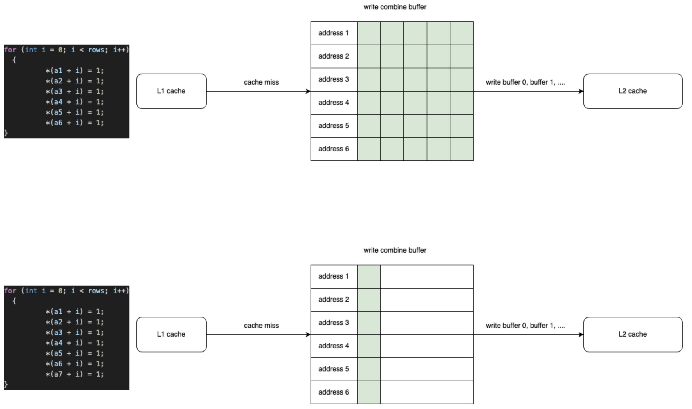
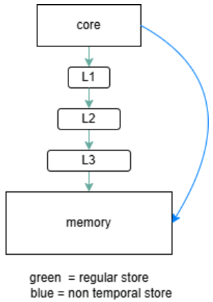
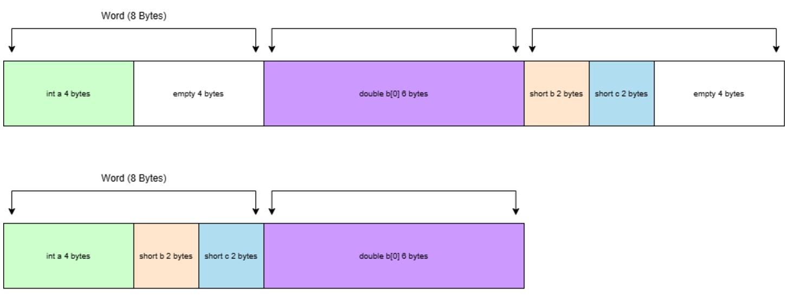

# CPU Memory Optimizations
Today CPU cores are very fast in comparision to memory access. Below are a few techniques that can be used to reduce memory access time.
### Write Combining
When we attempt to write past L1 cache we write to a line buffer before the next cache level. Depending on the hardware there are a limited number of buffers that can be written to. Each of these buffers correspond to unqiue addresses and can combine data written to the same address. This is known as write combining. We want to fill these buffers as much as possible to reduce the amount of writes we perform.


In the example above we have 6 buffers. Illustrated is the difference between writing to 6 unqiue addresses vs 7 or more. Once a new memory location is introduced we will be forced to write to cache before we can fill the buffers to the max.

`NOT TAKING FULL ADVATAGE OF WRITE COMBINING TIME TAKEN: 0.927197` <br>
`WRITE COMBINING TIME TAKEN: 0.253306` <br>

We can observe a rough 3x performance improvement by better utilizing write combining in our simple example.

### Bypassing Cache
By default nothing is directly written to memory. Everything goes through cache, if our cache space is full we replace older cache lines. In some situations we may have data that will not be accessed again anytime soon or frequently, making it a waste to use cache space. In these situations we can bypass cache and write directly to memory.



A simple example is we intialize two matrices, matA and matB. We write values to matA and then write values to matB. After writing values to matB, we want to read from matA. In this case since we will not be reading values of matB anytime soon we can make use of non temporal stores to write matB directly to memory. 

`NO CACHE BYPASS TIME TAKEN: 50.825197`<br>
`CACHE BYPASS TIME TAKEN: 15.427559`<br>

The simple example is roughly 3 times faster.

### Fitting into Cache Lines
Reading from cache is significantly faster than reading from memory. Therefore its important to fit as much data into cache as possible. CPU cache is a collection of  cache lines, in this case each cache line is 64 bytes long and read in `words`, a fixed size of bytes. We want to optimize the way we put data into `words` such that their are minimal holes.

```
struct hole
{
  int a;
  double b[6];
  short c;
  short d;
  int e;
  int f;
};
```
In the `struct` above we use 4 bytes and then 8 bytes, for a consecutive total of 12 bytes. Unforunately this cannot fit into a `word` of 8 bytes, so we are left with a `hole`.
```
/* size: 72, cachelines: 2, members: 6 */
```



If we organize our struct so that 2 shorts follow the int this can close the holes.

```
struct noHole
{
  int a;
  short b;
  short c;
  double d[6];
  int e;
  int f;
};
```

This simple change allows us to make better use of the available space.

```
/* size: 64, cachelines: 1, members: 6 */
```
Keep in mind fitting as much as possible into cache lines is not always the best solution, sometimes padding must be applied to prevent false sharing. <br>
*Note: CPU cache line and word size can differ by hardware.

### Huge Pages
Programs are broken up into pieces known as pages, this is done so we can store parts of our program in memory and secondary storage. A page table stores the location of each page in physical memory. Retrieving address translations from our page table is slow, their are several memory loads involved. However there's something known as a Translation Lookaside Buffer (TLB) which is a cache in the CPU dedicated to address translation. The TLB space is limited so we want to store as much as possible in there. A way to do this is by using larger page sizes. The default page size on most CPUs is 4KiB with suport for page sizes of 4MiB and 1GiB also included.

If we have a progam of size 1Gib, that means we have `1073741824 / 4096 = 262144 pages of size 4KiB` or `1073741824 / 2097152 = 512 pages of size 2MiB`.

It is evident with larger pages we have fewer addresses which in turn allows us to fit more into our Translation Lookaside Buffer.

A larger page size is best suited for programs that deal with large amounts of data. A common issue with larger page sizes is dealing with memory fragmentation as there is less flexibility.

The simplest way to make use of huge pages is by enabling transparent huge pages `echo always > /sys/kernel/mm/transparent_hugepage/enabled`.